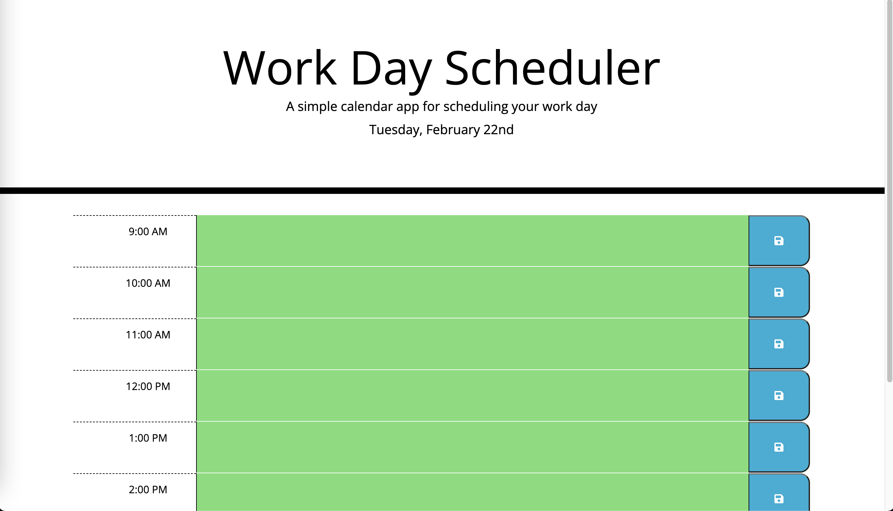

# Day Planner v1

This Day Planner application was designed to be a day planner for the busy working professional with a full schedule to plan for in their workday. 

## Installation

This web application is deployed on [GitHub Pages](https://jhahnsheen.github.io/Day-Planner-v1/) and can be used on your desktop straight from your internet browser.

Alternatively, the full repo containing the code for the web application can be found [on my GitHub](https://github.com/jhahnsheen/Day-Planner-v1).

## Usage

Upon loading the web application on your browser, you will be greeted with this screen. 

On this page, you can see three columns. The first column shows the time, the second is where you can type in your appointments, and the third contains a button that allows you to save this appointment to your computer's local storage.

One feature of this application is that it will update every day, meaning the date will change automatically and the time blocks will change color according to the time of day and by extension whether the appointment has passed or not.

As this is designed for the working professional to use during their workday for work appointments, the times displayed are only between 9AM and 5PM. 

This application is to be used only for educational and functional purposes. 